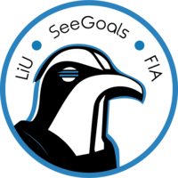

# See Goals Robot Controller

## Overview
### What is the purpose of this repo?
This is the repo containing the AI of the project. All the stratergies on how the robots will move and respond to opponents actions. This repo also is reponsible for the connections of our internal repos and external SSL repos.  

## Setup 🚀

Go to `https://github.com/LiU-SeeGoals/docker` and follow the setup in the README.md for running the code in docker containers.

After following the guide you should now have the containers running and the `controller` repo (this repo) running locally. Now you can go to the next step below.

### Running main script
Now the containers should be running. To run a program you need to enter the controller container. This can be done by running:
```
docker ps
```
Take note of the "container ID"
Then run this command to enter the container:
```
docker exec -it {first 3 letters of container ID} sh
``` 
Now you are inside the container. To start the controller main program, go to 
```
/var/controller/cmd
``` 
And then run:
```
go run main.go
``` 

Now the main program have been started. When making changes on the code on the repo on your computer locally, the code in the container is directly linked to it. This means you don't need to restart the container. You only need to stop the process by ctrl+C and then start it again for the updated code to take effect in the container.


## Project Structure

Project structure is based on: https://github.com/golang-standards/project-layout
If you ever wonder where to put new files, please refer to it.

## Code standard
This project uses the [SeeGoals Go standard](https://github.com/LiU-SeeGoals/wiki/wiki/1.-Processes-&-Standards#seegoal-%F0%93%85%B0---go-coding-standard).

## Compiling/Building

The project can be compiled by running `/scripts/build.sh`. This generates the executable in `/build` folder.

## Environment
Environment configuration cen be found in `.env`. This file is automatically loaded by the `config` package by the controller. It's strongly advised to use this file instead of hard coded solutions. Apart from the controller, the docker environment loads the `.env` file into its containers.

Following are the most important environment variables:

* `ENVIRONMENT` - environment flag to indicate what setup is being used
* `SSL_VISION_MULTICAST_ADDR` - multicast IP used by SSL vision
* `SSL_VISION_MAIN_PORT` - port used for tracking, detection, and geometry packets
* `SIM_ADDR` - sim IP address
* `SIM_COMMAND_LISTEN_PORT` - sim command listen port
* `GC_PUBLISH_ADDR` - multicast IP used by game controller
* `GC_PUBLISH_PORT` - publish port used by game controller
* `WEB_VISION_UI_PORT` - port on host machine for SSL vision UI when running docker
* `WEB_GC_UI_PORT` - port on host machine for game controller UI when running docker

## Updating protobuf files
Follow the instructions [here](https://github.com/LiU-SeeGoals/proto-messages) when you've updated the actual protobuf files. To make this project use the newest files from the proto-go repo, run `go get github.com/LiU-SeeGoals/proto_go@main`.

<!-- ## Docker environment
The docker environment should be used for local development. It uses sim to simulate the game.

To start the environment:
```sh
./scripts/compose_up.sh
```

This will start the docker environment (in detached mode). The Seegoals controller is meant to be run from inside the container. The controller container can be entered by:
```sh
./scripts/enter.sh
```

Taking down the environment is done with
```sh
./scripts/compose_down.sh
