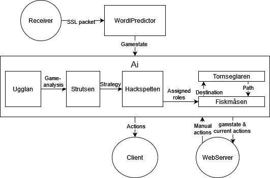

# See Goals Robot Controller

## Overview
### What is the purpose of this repo?
This is the repo containing the AI of the project. All the stratergies on how the robots will move and respond to opponents actions. This repo also is reponsible for the connections of our internal repos and external SSL repos.  

## Setup 🚀

Go to `https://github.com/LiU-SeeGoals/docker` and follow the setup in the README.md for running the code in docker containers.

After following the guide you should now have the containers running and the `controller` repo (this repo) running locally. Now you can go to the next step below.

### running main script
Now the containers should be running. To run a program you need to enter the controller container. This can be done by running:
```
docker ps
```
Take note of the "container ID"
Then run this command to enter the container:
```
docker exec -it {first 3 letters of container ID} sh
```
Now you are inside the container. To start the controller main program, go to 
```
~/cmd
```
And then run:
```
go run main.go
```

Now the main program have been started. 


## Project Structure

Project structure is based on: https://github.com/golang-standards/project-layout
If you ever wonder where to put new files, please refer to it. 

This diagram describes how different part of the controller interacts with each other. It does not follow any specific diagram standard but is meant to give intuition on how the controller works. Each part in the diagram is described in more detail below.



### Receiver
The Receiver in the diagram represent the SSLReceiver struct which is responsible for receiving packets from the SSL vision system and subscribing to its multicast address. The Receiver is indifferent to whether it's the real ssl system or the simulation. 

The packets received are serialized with protobuf and contains information about robot positions, ball position, field geometry etc. for e detailed list see [INSERT LINK TO PROTOBUF WIKI]. This information is not guaranteed to be correct, robots or the ball can be missing, this should be handled by the WordPredictor which is also the only owner of the receiver. 

The receiver is housed in the Receiver package and is its only inhabitant.

### WorldPredictor
The WordPredictor is a package responsible for parsing the data received from the receiver, filling in missing information, like velocities and untracked objects, and updating the gamestate.

The WordPredictor is initialized in the main loop and updated through the main loop. 

### Gamestate
The Gamestate is a package that houses structs that hold information of the current state of the game. It contains structs for the robots, the ball and the field which is the only information that the AI can use to make decisions. The Gamestate is updated by the WordPredictor.

All structs in the Gamestate package are serializable which is necessary so that it can be sent to the GameViewer through the WebServer.

One gamestate objects gets initialized in the main loop and given to the WordPredictor and AI as a pointer.

### AI
The ai is a package consisting of six subdirectories, each of which are explained below. 

One of the six subdirectories is the ai ("ai in ai"", I know its confusing) which contains the decision pipeline and manages communication with other parts of the controller. It also have access to the gamestate which is used in the decision loop to decided what actions are assigned to which robot. The ai is initialized in the main loop and given a pointer to the gamestate, this is the only way the ai can get information about the game. 

#### Decision pipeline
The decision piplene consists of five stages, each stage being a function of an AI system that operates on a game state. The stages are sequential and represent a pipeline where each stage contributes to the final decision:

```go
gameAnalysis := ai.ugglan.Analyse(ai.gamestate)
strategy := ai.strutsen.FindStrategy(gameAnalysis, ai.gamestate)
roles := ai.hackspetten.AssignRoles(strategy, ai.gamestate)
actions := ai.fiskmasen.GetActions(roles, ai.gamestate)
```
##### Ugglan
In this stage, the system analyzes the current state of the gamestate and produces an analysis that helps inform future decisions. For example it can divide the pitch into zones and determine which team has control over each zone.

##### Strutsen [NOT DECIDED]
This stage is not yet implemented but will be responsible for finding the best strategy for the current gamestate. This could be a high level strategy like "attack" or "defend" or a more detailed strategy like "Robot 1 covers opponent 4, Robot 2 moves the ball up the field".

##### Hackspetten [NOT DECIDED]
The purpose of this stage depends on what the previous stage outputs. If Strutsen outputs a high level strategy, Hackspetten will decide which roles robots are assigned to fulfill this strategy. If Strutsen outputs a more detailed strategy, then there is no real purpose of this stage. 

##### Fiskmåsen
Fiskmåsen is responsible for figuring out what actions on a low level the robots should take to fulfill the roles they have been assigned. These are the actions that will be sent to the robots so they are really low level. They could for example be rotate x degrees, move in this direction, kick the ball etc. Any role related to movement will be put through Tornseglaren which is the pathfinder.

##### Tornseglaren
This is a Pathfinder.

#### Communication
The ai struct can communicate with other parts of the controller in three ways, it can send actions to robots through the client, it can send the gamestate and actions to the GameViewer through the WebServer and it can receive manual actions from the GameViewer through the WebServer.

After the actions have been generated but before they are sent out to the robots through the client the ai checks if there are any manual actions that have been sent from the GameViewer. If there are any manual actions they are used instead of the generated actions. Finally the actions are sent to the client and the gamestate and actions are sent to the GameViewer.
T

### WebServer
Talks to the GameViewer, receives manual actions and sends gamestate and actions to the GameViewer.

### Client
This is where we send actions to the robots, the client is indifferent to whether it's the real robots or the simulation.

## Code standard
This project uses the [SeeGoals Go standard](https://github.com/LiU-SeeGoals/wiki/wiki/1.-Processes-&-Standards#seegoal-%F0%93%85%B0---go-coding-standard).

## Compiling/Building

The project can be compiled by running `/scripts/build.sh`. This generates the executable in `/build` folder.

## Environment
Environment configuration cen be found in `.env`. This file is automatically loaded by the `config` package by the controller. It's strongly advised to use this file instead of hard coded solutions. Apart from the controller, the docker environment loads the `.env` file into its containers.

Following are the most important environment variables:

* `ENVIRONMENT` - environment flag to indicate what setup is being used
* `SSL_VISION_MULTICAST_ADDR` - multicast IP used by SSL vision
* `SSL_VISION_MAIN_PORT` - port used for tracking, detection, and geometry packets
* `SIM_ADDR` - sim IP address
* `SIM_COMMAND_LISTEN_PORT` - sim command listen port
* `GC_PUBLISH_ADDR` - multicast IP used by game controller
* `GC_PUBLISH_PORT` - publish port used by game controller
* `WEB_VISION_UI_PORT` - port on host machine for SSL vision UI when running docker
* `WEB_GC_UI_PORT` - port on host machine for game controller UI when running docker

<!-- ## Docker environment
The docker environment should be used for local development. It uses sim to simulate the game.

To start the environment:
```sh
./scripts/compose_up.sh
```

This will start the docker environment (in detached mode). The Seegoals controller is meant to be run from inside the container. The controller container can be entered by:
```sh
./scripts/enter.sh
```

Taking down the environment is done with
```sh
./scripts/compose_down.sh
``` -->
